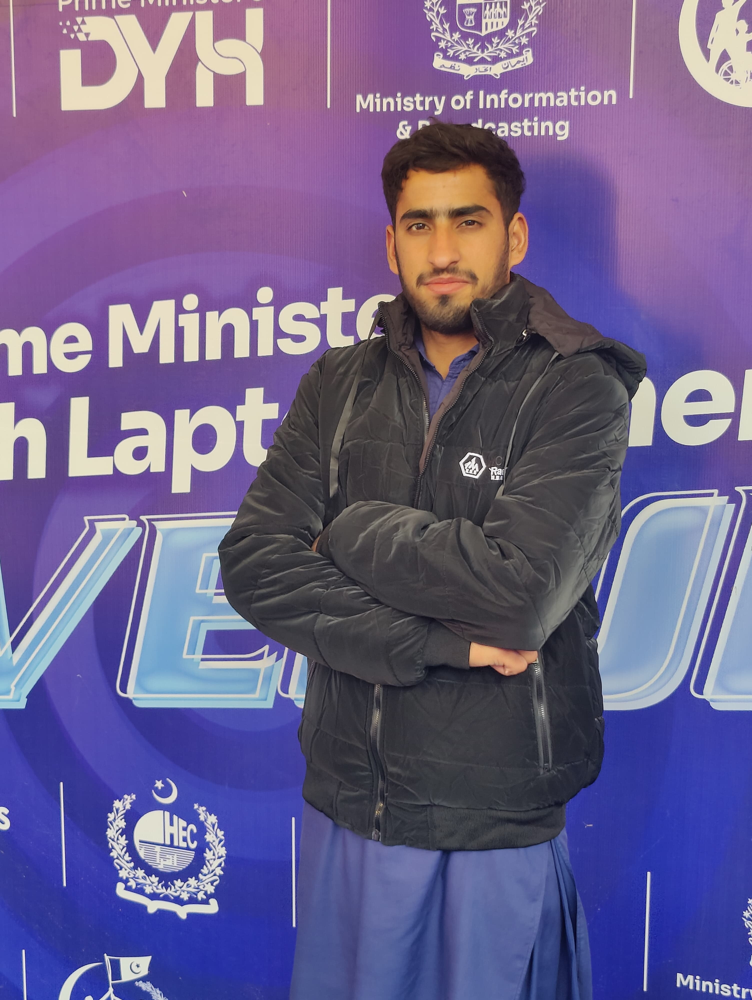

<h1 align="center">Hi 👋, I'm Muhammad Haroon</h1>
<h3 align="center">Computer Science Student | Future Data Scientist | Python Developer</h3>

 

<table>
  <tr>
    <!-- LEFT SIDE (About Section) -->
    <td width="60%" valign="top">
      
<h2>👨‍🎓 About Me</h2>

🎓 Computer Science Student at <b>University of AJK, Pakistan</b>   
💻 Strong command in <b>Python, C++, HTML, CSS, JavaScript</b>   
🎨 Skilled in <b>Adobe Photoshop & Adobe Illustrator</b>   
📊 Aspiring <b>Professional Data Scientist</b>   
🚀 Passionate about problem solving and continuous learning
 </tr>
    </tr>
    <td width="40%" align="center">
      
    </tr>

 
</table>

<h2>🛠️ Technical Skills</h2>

<b>Programming:</b> Python | C++ | JavaScript   
<b>Web Development:</b> HTML | CSS   
<b>Data Science:</b> NumPy | Pandas   
<b>Design Tools:</b> Photoshop | Illustrator

<h2>📊 GitHub Stats</h2>

  

  

<h3 align="center">💡 Code. Learn. Build. Repeat. 💡</h3>
